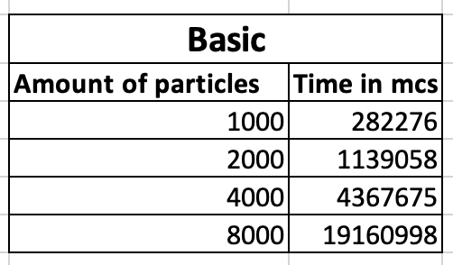
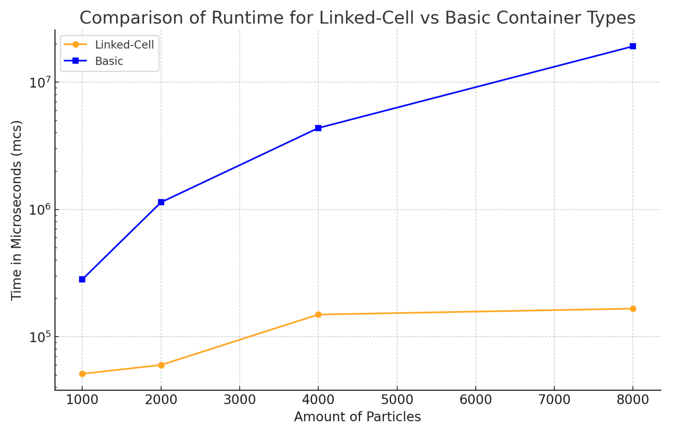

MolSim
===
# Group E #
Members:
* Layla
* Markus
* Sophy

# Code #
* Link:     https://github.com/sophykk/PSEMolDyn-GroupE.git
* Branch:   master
* Compiler: g++ 11.4.0
* Commit ID: last commit on the master branch
* Build and execute instructions:
 ```
 mkdir build
 cd build
 ccmake ..
 make
 ./MolSim ../input/<file_name>

Files: -w3t2.xml (Task 2)
       -w3t4.xml (Task 4)
       -1000p.xml/2000p.xml/4000p.xml/8000p.xml (for runtime measurements)
 
 Doxygen documentation: 
 make doc_doxygen
 To open documentation in the browser:
 doxys_documentation/html/index.html

UnitTests:
ctest
 
 then for the visualisation go into ParaView and open the beforehand generated MD_vtk folder/group, hit apply and use the glyph filter with the according configurations on it
```
# Report #
## Task 1 ##

- implemented a general schema for the simulation
- the files have to contain the simulationParams and optionally the lennardJonesForceParams, linkedCellParams, cuboids and/or spheres
- the XMLReader contains functions for reading each of the above mentioned parameters out of an xml file
- this functions are called in the main function based on the chosen modelType, containerType and objectType
- the following parameterTypes contain the following parameters:
  - simulationParams: endTime, deltaT, modelType, containerType, plotInterval and objectType
  - lennardJonesForceParams: sigma and epsilon
  - linkedCellParams: domainSize, cutoffRadius, boundaryCondition
  - cuboids: position, velocity, mass, grid, spacing, type
  - spheres: position, velocity, mass, spacing, radius, type

## Task 2 ##

- implemented a new particle container, which realizes the linked cell algo
- LinkedCellContainer2 contains a grid with cells made out of a special vector structure
- particleList is checked and based on the position the particles is assigned a cell
- generated different sizes of cuboids and calculated the runtime per iteration using the LinkedCellContainer and the BasicParticleContainer
- measured the time for 1000, 2000, 4000 and 8000 particles comparing performance for Basic and Linked-Cell Containers:

 

### Visualization Plot for the Time Measurements: ###


  
## Task 3 ##

- implemented the boundary conditions
- the used boundary condition is read from the input file as a char
- set boundaryCondition to 'r' for using the reflecting condition and to 'o' for using the outflow condition in the input file
- 'r' activates a function where it checks whether a particle is near the border and creates a halo particle to bounce it back if true

## Task 4 ##

- implemented a SphereGenerator, which generater the particles in form of a sphere
- adapted the Simulation.xsd schema, so the user can generate how many spheres he wants by just defining their properties in the input files
- conducted the experiment of a falling drop using the reflecting boundary condition
